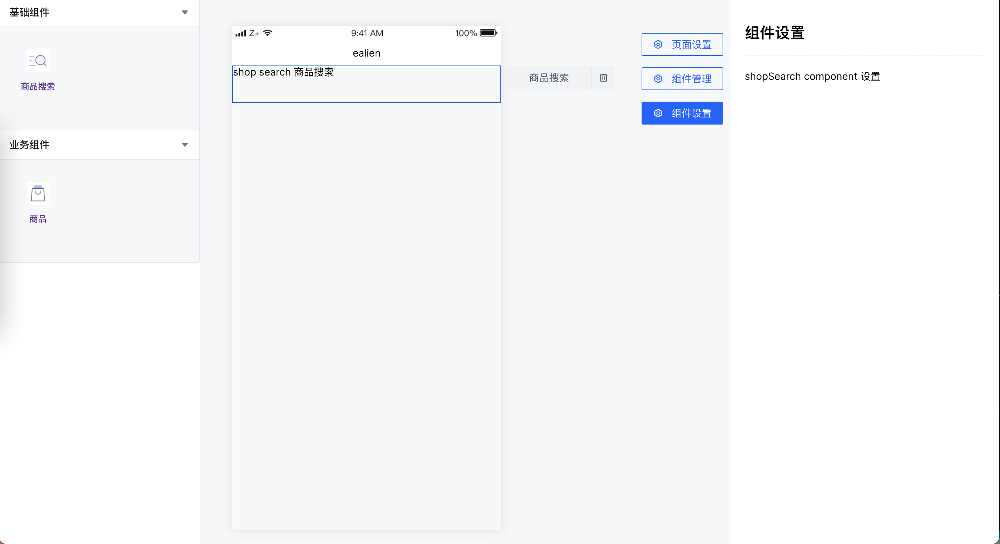
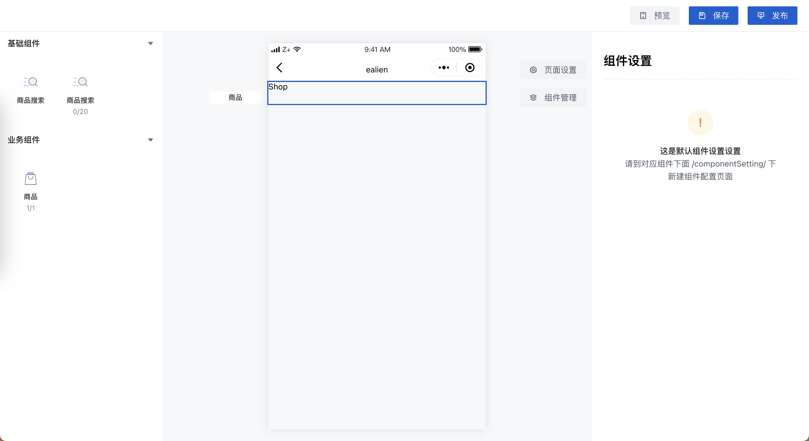

### 开发指北

#### 新增组件？
##### /widget 下新建组件， /config/panelSetting.js 新配置即可。

##### 页面设置可能会通用，所以文件夹位置在setting/pageSetting/[文件名称]下按照文件名称自动导入，使用时 component: '文件名称' 即可。
```js
  /autoImport/pageSettingMap.js 自动导入
```

##### 页面设置不自定义，通过url携带type值指定，可以自由组合 /config/pageSettingSelect.js 例：
```js
export const pageConfigSelect = type => {
  const pageConfigMap = new Map();
  const defaultSet = {
    /** 为页面设置配置初始化文件 */
    config: { title: '', name: '', age: null, gender: '', ... },
    /** 由 /autoImport/pageSettingMap.js 自动导入, 这里指定文件名称即可， 默认 defaultSetting */
    component: 'defaultSetting',
  };
  pageConfigMap.set('default', defaultSet);

  /** type 根据url链接参数获取 */
  return pageConfigMap.get(type || 'default');
};
```

##### 组件设置文件跟随可拖动组件引入，约定位置 widget/[组件名称]/componentSetting/[文件名], 自动导入， 使用时 component: '文件名称' 即可。
```js
  /autoImport/componentSettingMap.js 自动导入
```

#### config/panelSetting.js
```js

{
  id: '2',
  /** 
   * 分组名称
   */
  label: '业务组件',
  children: [
    {
      /** 命名规则：pid-id */
      id: '2-1',
      /** 装修组件名称 */
      label: '商品',
      /** 组件Icon */
      icon: '商品ICON',
      /** 
       * /autoImport/renderComponentsMap.js 自动导入
       * 设置widget下一级目录名称作为组件名即可 内部文件必须存在一个index.vue作为组件页面
       * */
      name: 'ShopSearch',
      /** 
       * /autoImport/componentSettingMap.js 自动导入
       * 组件所使用的组件配置页面
       * */
      useComponentName: 'shopSearchSetting'
      /** 组件配置 */
      componentConfig: {},
      /** 当前组件最大可渲染几个， 不填写或0表示无限制 */
      maxCount: 10,
      /** 当前组件渲染了几个， 字段可不填， 手动填写场景： 当前组件需要开通权限*/
      currentCount: 0,
    }
  ]
}

```

## 说明
  1、在不同的场景可能会遇到页面设置不同的情况，比如这个装修页可以配置页面背景，另一个装修页不可以，所以页面配置设置成了可配置选取，页面设置按照文档注册组合即可。
  2、panel内组件无需手动组册，只需按照约定填写文件名即可。
  3、每个组件配置和组件放入同一文件夹内componentSetting下自动导入，方便组件一起维护。

### 目前是模版状态，基本成型写想要的组件样式就可以了


### 新增组件渲染个数限制，部分优化

